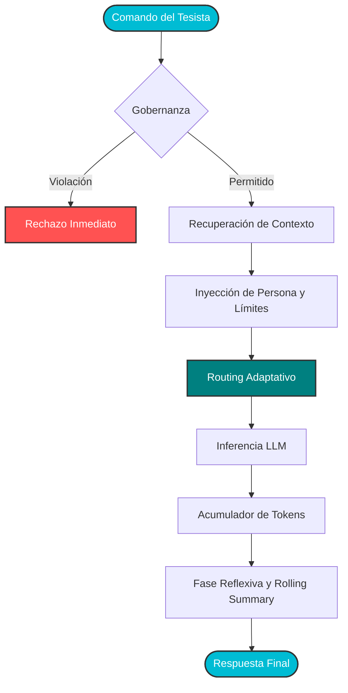
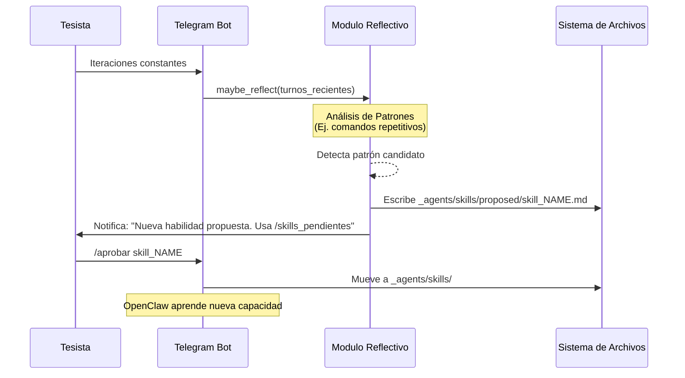

# Arquitectura y Casos de Uso del Agente OpenClaw

Este documento establece la base teórica y técnica del funcionamiento del agente soberano **OpenClaw** dentro del Sistema Operativo de Tesis. Describe cómo el agente procesa tareas, enruta la inferencia de manera adaptativa, consolida su memoria y evalúa su propia utilidad.

## 1. El Paradigma de Soberanía Híbrida

OpenClaw no es un simple envoltorio alrededor de un LLM. Es un **sistema de orquestación agéntica local** diseñado para operar con autonomía funcional, pero gobernanza estricta. Su rol principal es reducir la fricción en la ejecución de la tesis sin violar la trazabilidad inmutable del Ledger.

El sistema se fundamenta en tres pilares arquitectónicos:
- **Routing Adaptativo:** Decisión en tiempo real del motor de inferencia (CPU, GPU o Edge NPU) según la carga cognitiva requerida.
- **Ventana de Contexto Persistente (Rolling Summary):** Mantenimiento de memoria a largo plazo bajo un presupuesto de tokens finito.
- **Fase Reflexiva:** Capacidad de analizar patrones de interacción y proponer nuevas habilidades (*Skills*) codificadas.

---

## 2. Flujo de Vida de una Tarea

Cuando el tesista emite un comando estructurado (ej. `/investiga` o `/chat`), OpenClaw inicia un pipeline riguroso de validación, enrutamiento, síntesis y registro.



### Explicación del Pipeline
1. **Gobernanza Inmediata:** Antes de cualquier inferencia, el sistema verifica si la solicitud compromete archivos protegidos sin autorización.
2. **Contexto y Persona:** Se ensambla el *system prompt* usando formato ChatML (optimizado para Hermes 3 y Qwen 2.5), inyectando el estado actual de la tesis y las reglas operativas.
3. **Presupuesto de Tokens:** La inferencia es observada por un monitor de tokens que debita el uso del presupuesto diario del nodo.

---

## 3. Arquitectura de Routing Adaptativo (Edge vs. PC)

Uno de los aportes tecnológicos del sistema es la capacidad de decidir dinámicamente qué hardware ejecutará el modelo fundacional, balanceando latencia, consumo energético y calidad de síntesis.

```mermaid
graph LR
    subgraph Orquestador Local
        R[Router Adaptativo]
        idx[(index.json)]
    end

    subgraph PC Control (CUDA)
        H8B[Hermes 3: 8B]
        Q4B_PC[Qwen 2.5: 4B]
    end

    subgraph Nodo Edge IoT (NPU)
        Q3B[Qwen 2.5: 3B RKLLM]
    end

    R -. Lee Benchmark .-> idx
    R -- Tarea Compleja / Síntesis --> H8B
    R -- Tarea Simple / Alta Velocidad --> Q4B_PC
    R -- Operación Desconectada / IoT --> Q3B

    classDef tech fill:#f9f9f9,stroke:#666,stroke-width:1px;
    class H8B,Q4B_PC,Q3B tech;
```

### Criterios de Enrutamiento
- **Hermes 3 (8B):** Se selecciona si el archivo de benchmark (`index.json`) determina que el modelo supera los **25 Tokens Por Segundo (TPS)**. Al ser un modelo más grande, garantiza mayor calidad en síntesis académica, revisión de literatura y análisis complejo, siempre que la GPU local (RTX) soporte la carga eficientemente.
- **Qwen 2.5 (3B/4B):** Actúan como baselines ultrarrápidos (hasta 85 TPS). Se priorizan para tareas mecánicas, consultas rápidas de estado, o cuando se opera desde el nodo Edge (Orange Pi 5 Plus usando inferencia nativa NPU).

---

## 4. La Fase Reflexiva y Generación de Skills

Para evitar el estancamiento evolutivo, OpenClaw implementa una **fase reflexiva no bloqueante** al final de los ciclos de interacción.



Esta mecánica asegura que el agente desarrolle herramientas específicas (como monitores hardware o parsers de datos) de forma orgánica según las necesidades reales del investigador, pero exigiendo siempre un `[VAL-STEP]` explícito del tesista para activar la nueva habilidad.

_Última actualización: `2026-05-15`._
