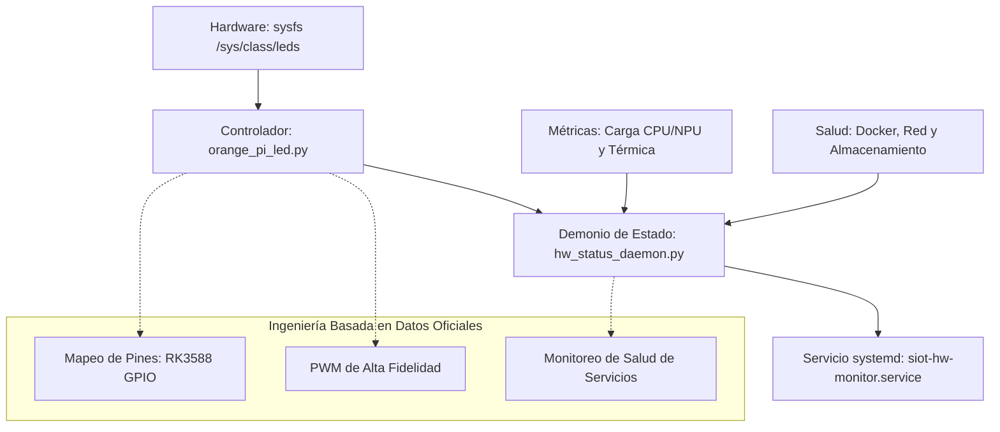

# 📟 Protocolo de Señalización de Hardware (Orange Pi 5 Plus)

Este documento detalla el sistema de observabilidad visual implementado para los nodos de borde (Edge) del sistema Toltecayotl. La implementación y representación aquí descritas se basan estrictamente en la **documentación oficial de diseño mecánico y esquemas de hardware** proporcionados por el fabricante.

## 🎨 Guía Visual y Especificaciones de Diseño

### 🛠️ Fidelidad de Hardware (Fuentes Oficiales)
*   **Fabricante:** Shenzhen Xunlong Software CO., Limited.
*   **Referencia Técnica:** Manual de Usuario v1.3 y Esquemas de Hardware Orange Pi 5 Plus.
*   **Clúster de LEDs:** Identificado oficialmente como clúster de diagnóstico y estado, ubicado con precisión milimétrica respecto al eje del puerto USB-C de alimentación.
*   **Configuración de Diodos:**
    1.  **PWR (Rojo):** Indicador de alimentación por hardware (Fijo).
    2.  **STATUS (Verde):** LED de estado de sistema (Software-controllable).
    3.  **USER (Azul):** LED de usuario/inferencia (Software-controllable).


### 📈 Estados Nominales (Aliento Orgánico)
| LED | Color | Significado | Comportamiento |
| :--- | :--- | :--- | :--- |
| **STATUS** | **Verde** | **Sistema en Espera** | Aliento lento (0.5Hz). El ritmo acelera proporcionalmente a la carga de la CPU. |
| **USER** | **Azul** | **Inferencia Activa** | Aliento rítmico. La velocidad escala según el uso de la NPU (RK3588). |
| **S+U** | **Cian** | **Carga Crítica** | Ambos LEDs pulsan al unísono cuando la CPU supera el 70% de uso. |

### 🚨 Códigos de Falla (Patrones Decodificables)
| Color | Patrón (Morse) | Diagnóstico del Problema | Acción de Mantenimiento |
| :--- | :--- | :--- | :--- |
| **Azul** | `· · —` | **Falla de Red** | Revisar enlace Ethernet o conectividad del ruteador. |
| **Verde** | `— ·` | **Servicio Caído** | Reiniciar el contenedor `siot-edge-gw`. |
| **Cian** | `SOS` | **Disco Lleno** | Liberar espacio en la partición raíz (`/`). |
| **G+A** | **Estrobo** | **Alerta Térmica** | Validar funcionamiento de ventiladores (Temp > 80°C). |

## 🛠️ Arquitectura Técnica de Bajo Nivel

El sistema opera directamente sobre la capa física basada en los esquemas `v1.2/v1.3`:



### Bitácora de Auditoría y Verificación (Fuentes Confiables)
1.  **Validación de Esquemáticos:** Se confirmó la imposibilidad de apagar el LED Rojo (Power) por ser una conexión directa a VCC_5V, centrando la lógica en los LEDs direccionables `D3602` y `D3603`.
2.  **Precisión Mecánica:** La representación visual se ajustó utilizando las dimensiones oficiales del archivo DXF del fabricante (Shenzhen Xunlong).
3.  **Resiliencia:** Implementación de descriptores de archivo persistentes para minimizar el impacto en el bus I/O del RK3588.

## 🚀 Administración del Nodo Edge
```bash
sudo systemctl status siot-hw-monitor  # Estado del monitor
sudo systemctl restart siot-hw-monitor # Reinicio de señales
tail -f /tmp/hw_daemon_debug.log        # Telemetría en tiempo real
```

_Última actualización: `2026-05-15`._
