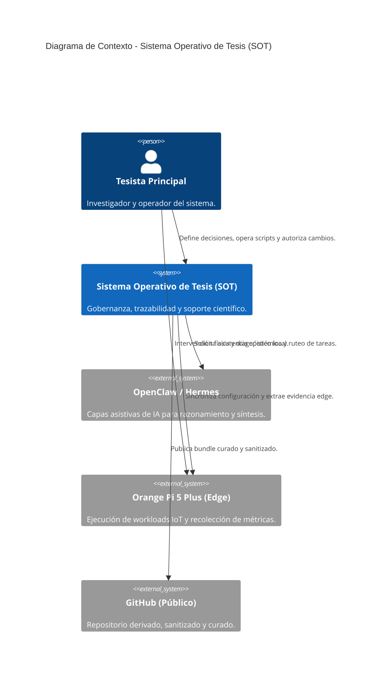
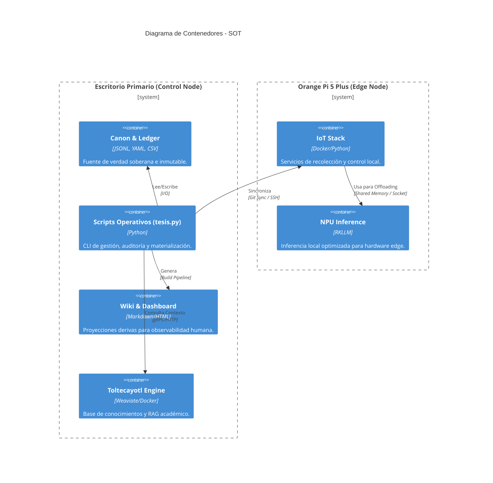
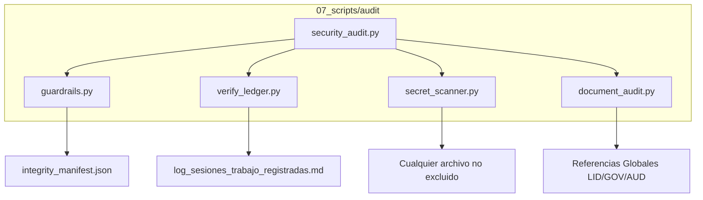

# Arquitectura

Estructura del sistema, topología, contenedores y diagramas C4.

- **Tesista:** `Erick Renato Vega Ceron`
- **Fecha:** `2026-05-15`
- **Estado:** `OK`
- **Fuentes:** `docs/02_arquitectura/arquitectura-general.md`, `docs/02_arquitectura/diagramas_c4.md`, `docs/02_arquitectura/mapa-de-interconexiones.md`, `docs/02_arquitectura/mapa-de-servicios.md`
- **Aviso:** Esta wiki es un artefacto generado. Edita las fuentes canónicas y vuelve a construir.

## Navegación de esta página

- [Volver al índice](index.md).
- Página anterior en la ruta base: [Gobernanza](gobernanza.md).
- Página siguiente en la ruta base: [Terminología](terminologia.md).
- Relacionada: [Sistema](sistema.md).
- Relacionada: [Gobernanza](gobernanza.md).
- Relacionada: [Decisiones](decisiones.md).

## Origen canónico y artefactos relacionados

### Cómo rastrear esta página hasta su origen canónico

1. Esta página derivada: [`06_dashboard/wiki/arquitectura.md`](arquitectura.md).
2. Revisa la lista de fuentes canónicas que alimentan su contenido.
3. Si necesitas la versión visual derivada, consulta el HTML hermano generado.
4. Si necesitas divulgación o evaluación externa, consulta el artefacto público sanitizado equivalente.
5. Si necesitas cambiar el contenido, edita la fuente canónica y reconstruye; no edites esta salida a mano.

### Fuentes canónicas declaradas

|Fuente canónica|Tipo|Existe|
|---|---|---|
|[`docs/02_arquitectura/arquitectura-general.md`](https://github.com/Dtcsrni/Sistema_Operativo_Tesis_Publico/blob/main/docs/02_arquitectura/arquitectura-general.md)|archivo|sí|
|[`docs/02_arquitectura/diagramas_c4.md`](https://github.com/Dtcsrni/Sistema_Operativo_Tesis_Publico/blob/main/docs/02_arquitectura/diagramas_c4.md)|archivo|sí|
|[`docs/02_arquitectura/mapa-de-interconexiones.md`](https://github.com/Dtcsrni/Sistema_Operativo_Tesis_Publico/blob/main/docs/02_arquitectura/mapa-de-interconexiones.md)|archivo|sí|
|[`docs/02_arquitectura/mapa-de-servicios.md`](https://github.com/Dtcsrni/Sistema_Operativo_Tesis_Publico/blob/main/docs/02_arquitectura/mapa-de-servicios.md)|archivo|sí|

### Artefactos derivados relacionados

- Markdown interno: [`06_dashboard/wiki/arquitectura.md`](arquitectura.md)
- HTML interno: [`06_dashboard/generado/wiki/arquitectura.html`](https://github.com/Dtcsrni/Sistema_Operativo_Tesis_Publico/blob/main/06_dashboard/wiki_html/arquitectura.html)
- Markdown público sanitizado: [`06_dashboard/publico/wiki/arquitectura.md`](arquitectura.md)
- HTML público sanitizado: [`06_dashboard/publico/wiki_html/arquitectura.html`](https://github.com/Dtcsrni/Sistema_Operativo_Tesis_Publico/blob/main/06_dashboard/wiki_html/arquitectura.html)

# Arquitectura General

## Proposito
El repositorio canónico es la fuente de verdad operacional del Sistema Operativo de Tesis. Su funcion es gobernar instalacion, operacion, seguridad, trazabilidad, soporte cientifico y despliegue sobre una topologia de trabajo con escritorio primario y nodo edge en Orange Pi 5 Plus.

## Topologia operativa
- `desktop_workspace`: PC de escritorio con Visual Studio Code como estacion principal de autoria, diseno, analisis, construccion documental y mantenimiento del repositorio soberano.
- `orange_pi_edge`: Orange Pi como nodo edge operativo para `edge_iot`, observabilidad local, servicios del stack IoT y capacidades que deban vivir cerca del hardware o del entorno fisico. El host SSH operativo del nodo se nombra `tesis-edge` y el usuario dedicado para agentes es `tesisai`.
- Integracion principal: `git_sync` + artefactos y contratos explicitos.
- Retorno desde Orange Pi: logs operativos, evidencia edge, metricas y artefactos locales derivados.
- No es flujo normal usar un workspace remoto montado por red ni convertir la Orange Pi en la superficie principal de redaccion o decisiones arquitectonicas.

## Capas
- `canon`: `00_sistema_tesis/canon/`, ledger, matriz, backlog y configuracion soberana.
- `auditoria_guardrails`: validadores, governance gate, chequeos de estructura, conformidad y evidencia.
- `proyecciones`: `README.md`, wiki derivada, dashboard y manifiestos generados.
- `publicacion`: bundle publico sanitizado en `06_dashboard/publico/`.
- `memoria_derivada`: `MEMORY.md` como resumen operativo generado desde canon y trazabilidad.
- Contexto complementario: `docs/`, `manifests/`, `bootstrap/`, `ops/`, `runtime/openclaw/`, `02_experimentos/`, `04_implementacion/`, `05_tesis/`.

## Reglas
- El trabajo principal de tesis ocurre en `desktop_workspace`.
- `orange_pi_edge` ejecuta edge, pruebas tecnicas locales, diagnostico operativo y control del stack IoT sin sustituir la autoria principal del escritorio.
- La sincronizacion entre nodos debe pasar por Git, artefactos generados, contratos de datos o evidencia edge explicitamente intercambiada.
- El sistema base debe operar sin OpenClaw.
- Toda exposicion externa sale del downstream publico sanitizado.
- Hardware, edge, tesis y administracion se separan por dominio.
- Solo el `canon` es fuente de verdad.
- `proyecciones`, `publicacion` y `memoria_derivada` son artefactos reconstruibles y nunca deben corregirse a mano.
- `auditoria_guardrails` puede bloquear y medir, pero no inventa estado canónico.

## Flujos y ownership
- `canon -> auditoria_guardrails`: lectura controlada para validacion y enforcement.
- `canon -> proyecciones`: materializacion determinista de README, wiki y dashboard.
- `canon -> memoria_derivada`: resumen operativo de retoma rapida sin memoria informal del agente.
- `proyecciones -> publicacion`: build sanitizado y curado editorialmente.
- Ownership logico:
  - `canon.py` mantiene canon y trazabilidad materializada.
  - `build_*` generan derivados.
  - `publication.py` solo publica derivados sanitizados.
  - `validate_*` y `build_all.py` verifican, perfilan y bloquean drift.

## Evolucion y cambios breaking
- Cambios aditivos al esquema canónico pueden mantenerse dentro de `1.x` si preservan compatibilidad hacia atrás.
- Cambios breaking requieren `major` nuevo, registro en `docs/05_reproducibilidad/migraciones-canonicas.md` y actualización de contratos.
- Cambios breaking en salida de `tesis.py` requieren actualizar el contrato CLI y su suite de conformidad.

## Validacion
- `python 07_scripts/validate_structure.py`
- `python 07_scripts/validate_memory.py`
- `python 07_scripts/tesis.py doctor --check`
- `python 07_scripts/build_all.py`

---

# Diagramas de Arquitectura (Modelo C4)

Este documento utiliza el estándar C4 para visualizar la arquitectura del Sistema Operativo de Tesis en diferentes niveles de abstracción.

## 1. Nivel 1: Contexto del Sistema
El diagrama de contexto muestra cómo el Sistema Operativo de Tesis interactúa con los actores humanos y otros sistemas externos.

## 2. Nivel 2: Contenedores
El diagrama de contenedores detalla los componentes lógicos internos del SOT y cómo se distribuyen entre el Escritorio y el nodo Edge.

## 3. Nivel 3: Componentes (Scripts de Auditoría)
Muestra la interacción interna de la capa de auditoría y guardrails.

---

# Mapa de Interconexiones

## Bloques
- `desktop_workspace` en Windows 11 con VS Code para autoria, analisis y administracion del repo soberano.
- Orange Pi 5 Plus como nodo base y clon operativo del sistema de tesis en `/srv/tesis/repo`.
- Nodo edge y perifericos como dominio separado.
- Herramientas asistivas como OpenClaw en capa opcional desacoplada.

## Canales de datos
- `desktop_workspace -> /srv/tesis/repo`: sincronizacion Git del repo canonico con `pull --ff-only`.
- `desktop_workspace -> edge_iot`: contratos y artefactos explicitamente necesarios para despliegue o validacion.
- `orange_pi_edge -> desktop_workspace`: logs, metricas, `outbox` y `spool` del dominio `edge_iot`, especialmente desde `/srv/tesis/intercambio/edge`.
- Entre dominios locales de Orange Pi, el intercambio sigue limitado a `/srv/tesis/intercambio/...`.

## Perfiles operativos edge
- `repo-only`: alineacion del clon operativo sin tocar servicios.
- `repo+postcheck`: alineacion del clon mas validacion edge local.
- `repo+restart-edge`: alineacion del clon, validacion edge y reinicio controlado de `edge-iot-worker.service`.

## Regla
Toda conexion electrica y de datos debe validarse contra datasheet y checklist pre-energizacion.

---

# Mapa de Servicios

Fuente maquina-legible: `manifests/service_matrix.yaml`.

## Servicios previstos
- `tesis-healthcheck.service` + timer bajo dominio `sistema_tesis`.
- `tesis-backup.service` + timer bajo dominio `administrativo`.
- `tesis-sync.service` + timer bajo dominio `sistema_tesis`.
- `openclaw-gateway.service` como servicio opcional bajo dominio `openclaw`.
- `ollama.service` como runtime principal local opcional bajo dominio `openclaw`.
- Carril NPU experimental instalado por bootstrap, sin convertirse en servicio base obligatorio.
- `openclaw-telegram-bot.service` como canal remoto activo bajo dominio `openclaw`.
- `openclaw-matrix-bot.service` como infraestructura latente y deshabilitada por defecto bajo dominio `openclaw`.
- `edge-iot-worker.service` como servicio genérico del dominio `edge_iot`.
- `edge-iot-watchdog.service` + timer como watchdog híbrido para recuperación y cuarentena del dominio `edge_iot`.
- `prometheus.service` para scraping local y retención larga bajo dominio `administrativo`.
- `prometheus-node-exporter.service` como exporter local del host y textfile collector.
- `tesis-observabilidad-collector.service` + timer para generar métricas por dominio sin mezcla de runtime.
- `tesis-backup.service` como orquestador administrativo de backups por dominio, snapshots locales y validación de restore.

## Nota
OpenClaw no es prerequisito del sistema base ni del pipeline edge.

## Ownership por dominio
- `sistema_tesis`: usuario `tesis`, acceso mínimo a repo, outputs y logs del sistema.
- `openclaw`: usuario `openclaw`, escritura solo en su namespace, en sus logs y en el intercambio controlado.
- `administrativo`: usuarios `tesisadmin` y `prometheus`, lectura controlada de estados, observabilidad local y escritura solo a backups, snapshots, logs administrativos y textfile collector.
- `edge_iot`: usuario `edgeiot`, sin acceso directo a canon, publicación ni SQLite de `openclaw`, con runtime de resiliencia en `/var/lib/edge-iot/runtime`.
- La fuente máquina-legible incorpora `usuario`, `grupo`, `read_only_paths`, `read_write_paths`, `network_profile` y `hardening`.

---

_Última actualización: `2026-05-14`._
