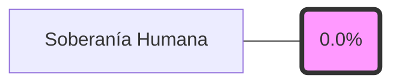

# Wiki verificable del sistema operativo de tesis

Definir la wiki derivada, verificable y reconstruible del sistema operativo de tesis a partir de fuentes canónicas.

- **Tesista:** `Erick Renato Vega Ceron`
- **Fecha:** `[fecha_hora_redactada]`
- **Estado:** `OK`
- **Fuentes:** `README_INICIO.md`, `00_sistema_tesis/manual_operacion_humana.md`, `00_sistema_tesis/documentacion_sistema/proposito_y_alcance.md`, `00_sistema_tesis/documentacion_sistema/mapa_de_modulos.md`, `00_sistema_tesis/documentacion_sistema/flujos_operativos.md`, `00_sistema_tesis/documentacion_sistema/interaccion_por_actor.md`, `00_sistema_tesis/documentacion_sistema/glosario_terminologia_y_convenciones.md`, `00_sistema_tesis/03_metadatos/sistema_operativo_tesis_iot__convencion_de_nombres__v09.json`, `00_sistema_tesis/config/sistema_tesis.yaml`, `00_sistema_tesis/config/hipotesis.yaml`, `00_sistema_tesis/config/bloques.yaml`, `00_sistema_tesis/config/dashboard.yaml`, `00_sistema_tesis/config/ia_gobernanza.yaml`, `00_sistema_tesis/config/publicacion.yaml`, `01_planeacion/backlog.csv`, `01_planeacion/riesgos.csv`, `01_planeacion/roadmap.csv`, `01_planeacion/entregables.csv`, `00_sistema_tesis/decisiones`, `00_sistema_tesis/bitacora`, `00_sistema_tesis/reportes_semanales`, `02_experimentos`, `04_implementacion`, `05_tesis`
- **Aviso:** Esta wiki es un artefacto generado. Edita las fuentes canónicas y vuelve a construir.

## Estado de verificación

- Fecha de generación: `[fecha_hora_redactada]`
- Estado de verificación: `ok`
- Fuentes canónicas: `README_INICIO.md`, `00_sistema_tesis/manual_operacion_humana.md`, `00_sistema_tesis/documentacion_sistema/proposito_y_alcance.md`, `00_sistema_tesis/documentacion_sistema/mapa_de_modulos.md`, `00_sistema_tesis/documentacion_sistema/flujos_operativos.md`, `00_sistema_tesis/documentacion_sistema/interaccion_por_actor.md`, `00_sistema_tesis/documentacion_sistema/glosario_terminologia_y_convenciones.md`, `00_sistema_tesis/03_metadatos/sistema_operativo_tesis_iot__convencion_de_nombres__v09.json`, `00_sistema_tesis/config/sistema_tesis.yaml`, `00_sistema_tesis/config/hipotesis.yaml`, `00_sistema_tesis/config/bloques.yaml`, `00_sistema_tesis/config/dashboard.yaml`, `00_sistema_tesis/config/ia_gobernanza.yaml`, `00_sistema_tesis/config/publicacion.yaml`, `01_planeacion/backlog.csv`, `01_planeacion/riesgos.csv`, `01_planeacion/roadmap.csv`, `01_planeacion/entregables.csv`, `00_sistema_tesis/decisiones`, `00_sistema_tesis/bitacora`, `00_sistema_tesis/reportes_semanales`, `02_experimentos`, `04_implementacion`, `05_tesis`

## Métrica de Soberanía Humana

Actualmente, el **0.0%** de los artefactos nucleares de esta tesis han sido verificados y firmados por el tesista humano.

## Índice

- [Sistema](sistema.md)
- [Gobernanza](gobernanza.md)
- [Terminología](terminologia.md)
- [Hipótesis](hipotesis.md)
- [Bloques](bloques.md)
- [Planeación](planeacion.md)
- [Decisiones](decisiones.md)
- [Bitácora](bitacora.md)
- [Experimentos](experimentos.md)
- [Implementación](implementacion.md)
- [Tesis](tesis.md)

## Qué explica esta documentación

- Para qué y por qué existe el sistema.
- Cuáles son sus módulos y cómo se relacionan.
- Cuáles son sus flujos operativos principales.
- Cómo interactúa con él el tesista.
- Cómo puede explorarlo y evaluarlo un lector público sin acceder a superficies privadas.

## Ruta de lectura

- Si necesitas entender el sistema completo, empieza por [Sistema](sistema.md).
- Si necesitas reglas y límites, continúa con [Gobernanza](gobernanza.md).
- Si necesitas lenguaje, familias de IDs y convenciones, pasa por [Terminología](terminologia.md).
- Si necesitas estado del trabajo, revisa [Planeación](planeacion.md), [Hipótesis](hipotesis.md) y [Bloques](bloques.md).
- Si necesitas evidencia de avance o cobertura, revisa [Decisiones](decisiones.md), [Bitácora](bitacora.md), [Implementación](implementacion.md), [Experimentos](experimentos.md) y [Tesis](tesis.md).

## Mapa de navegación por intención

- Entender el sistema: [Sistema](sistema.md) -> [Gobernanza](gobernanza.md) -> [Terminología](terminologia.md).
- Retomar ejecución: [Planeación](planeacion.md) -> [Bloques](bloques.md) -> [Hipótesis](hipotesis.md).
- Rastrear decisiones y sesiones: [Decisiones](decisiones.md) -> [Bitácora](bitacora.md).
- Revisar madurez técnica: [Experimentos](experimentos.md) -> [Implementación](implementacion.md) -> [Tesis](tesis.md).

## Cómo rastrear un artefacto derivado hasta su origen canónico

- Empieza por la página derivada que estás leyendo.
- Revisa su bloque `Origen canónico y artefactos relacionados`.
- Sigue la lista de fuentes canónicas declaradas en esa misma página.
- Si necesitas validar la cadena de publicación, cruza con `06_dashboard/generado/wiki_manifest.json` y `06_dashboard/publico/manifest_publico.json`.
- Si necesitas trazabilidad operativa interna, consulta `00_sistema_tesis/bitacora/matriz_trazabilidad.md` y `00_sistema_tesis/bitacora/log_conversaciones_ia.md`.

## Módulos del sistema

- Gobierno y soberanía humana.
- Trazabilidad y evidencia.
- Planeación y control del trabajo.
- Canon técnico y configuración.
- Automatización y validación.
- Publicación derivada y superficie pública.
- Tesis IoT como objeto gobernado.

## Operación humana y frontera público/privado

- La superficie **privada** gobierna canon, backlog, decisiones, bitácora y auditoría completa.
- La superficie **pública** es un bundle sanitizado, derivado y reproducible para divulgación y evaluación externa.
- La **IA es opcional**: el sistema debe poder retomarse, auditarse y publicarse siguiendo rutas humanas explícitas.

## Qué revisar siempre

- `00_sistema_tesis/manual_operacion_humana.md`
- `00_sistema_tesis/config/sistema_tesis.yaml`
- `01_planeacion/backlog.csv`
- `01_planeacion/riesgos.csv`
- `00_sistema_tesis/bitacora/matriz_trazabilidad.md`
- `06_dashboard/generado/wiki_manifest.json`
- `06_dashboard/wiki/index.md`
- `06_dashboard/generado/index.html`
- `06_dashboard/publico/index.md`

## Criterios de verificabilidad

- Toda página debe declarar sus fuentes canónicas.
- Toda página debe exponer fecha de generación y estado de verificación.
- La wiki debe reflejar directorios vacíos como cobertura pendiente, sin inventar contenido.
- Toda salida debe poder regenerarse de forma determinista desde scripts versionados.

