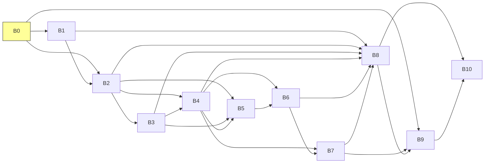

!!! success "Validación Humana: VERIFICADA"
    Este contenido ha sido supervisado y firmado por el tesista humano. (hash omitido: `0cf8a4ff...`)

# Bloques

Bloques macro del sistema y sus criterios de salida.

- **Tesista:** `Erick Renato Vega Ceron`
- **Fecha:** `2026-04-03`
- **Estado:** `OK`
- **Fuentes:** `00_sistema_tesis/config/bloques.yaml`
- **Aviso:** Esta wiki es un artefacto generado. Edita las fuentes canónicas y vuelve a construir.

## Navegación de esta página

- [Volver al índice](../publico/wiki/index.md).
- Página anterior en la ruta base: [Hipótesis](../publico/wiki/hipotesis.md).
- Página siguiente en la ruta base: [Decisiones](../publico/wiki/decisiones.md).
- Relacionada: [Planeación](../publico/wiki/planeacion.md).
- Relacionada: [Hipótesis](../publico/wiki/hipotesis.md).
- Relacionada: [Implementación](../publico/wiki/implementacion.md).

## Origen canónico y artefactos relacionados

### Cómo rastrear esta página hasta su origen canónico

1. Esta página derivada: [`06_dashboard/wiki/bloques.md`](../publico/wiki/bloques.md).
2. Revisa la lista de fuentes canónicas que alimentan su contenido.
3. Si necesitas la versión visual derivada, consulta el HTML hermano generado.
4. Si necesitas divulgación o evaluación externa, consulta el artefacto público sanitizado equivalente.
5. Si necesitas cambiar el contenido, edita la fuente canónica y reconstruye; no edites esta salida a mano.

### Fuentes canónicas declaradas

|Fuente canónica|Tipo|Existe|
|---|---|---|
|[`00_sistema_tesis/config/bloques.yaml`](https://github.com/Dtcsrni/Sistema_Operativo_Tesis_Publico/blob/main/00_sistema_tesis/config/bloques.yaml)|archivo|sí|

### Artefactos derivados relacionados

- Markdown interno: [`06_dashboard/wiki/bloques.md`](../publico/wiki/bloques.md)
- HTML interno: [`06_dashboard/generado/wiki/bloques.html`](../publico/wiki_html/bloques.html)
- Markdown público sanitizado: [`06_dashboard/publico/wiki/bloques.md`](../publico/wiki/bloques.md)
- HTML público sanitizado: [`06_dashboard/publico/wiki_html/bloques.html`](../publico/wiki_html/bloques.html)

## Qué resuelve este subsistema

- Ordena la tesis como una secuencia de bloques mayores con dependencias explícitas.
- Permite distinguir qué parte del sistema está activa, cuál depende de otra y cuál sigue pendiente.
- Sirve como puente entre gobernanza macro y backlog operativo detallado.

## Lectura rápida

- Bloques activos: `1`
- Bloques no iniciados: `10`
- Un bloque no se interpreta como completado solo por existir en la estructura; depende de su criterio de salida.

## Grafo de Dependencias

## Bloques del sistema

|ID|Nombre|Estado|Prioridad|Dependencias|Criterio de salida|
|---|---|---|---|---|---|
|B0|Gobierno del sistema de tesis y base operativa|activo|critica|ninguna|Existe una base operativa funcional con validadores, dashboard generado, plantillas y README de retoma rápida.|
|B1|Delimitación del problema y contexto de Pachuca|no_iniciado|alta|B0|Existe una definición trazable del caso de estudio y de los supuestos urbanos/intermitentes que alimentan diseño y simulación.|
|B2|Diseño de arquitectura y formulación de hipótesis|no_iniciado|critica|B0, B1|La arquitectura objetivo, la línea base, los flujos críticos y las hipótesis quedan definidos con métricas y criterios de soporte.|
|B3|Modelo de control y métricas de desempeño|no_iniciado|alta|B2|Se cuenta con definición operacional de métricas, escenarios y umbrales de comparación para simulación y experimento.|
|B4|Simulación y escenarios de intermitencia|no_iniciado|critica|B2, B3|La simulación reproduce escenarios definidos, genera métricas comparables y deja trazabilidad de parámetros y semillas.|
|B5|Implementación de prototipo y canal de continuidad|no_iniciado|alta|B2, B3, B4|Existe un prototipo verificable con instrumentación suficiente para comparar comportamiento con la simulación.|
|B6|Validación experimental|no_iniciado|critica|B4, B5|Se cuenta con evidencia experimental trazable, repetible y suficiente para contrastar resultados simulados y soportar o rechazar hipótesis.|
|B7|Análisis integrado y discusión|no_iniciado|alta|B4, B6|Queda una narrativa coherente de soporte, límites y transferencia de resultados con trazabilidad a evidencias primarias.|
|B8|Redacción de tesis y ensamblaje documental|no_iniciado|alta|B1, B2, B3, B4, B6, B7|Existe un manuscrito completo, consistente y alineado con aportaciones, limitaciones y evidencia disponible.|
|B9|Reproducibilidad y versión sanitizada pública|no_iniciado|media|B0, B7, B8|Se cuenta con una ruta reproducible para publicar materiales sanitizados sin romper la canonicidad privada del repositorio.|
|B10|Cierre, defensa y transferencia|no_iniciado|media|B8, B9|La tesis, la defensa y los artefactos de cierre quedan completos, versionados y listos para consulta futura.|

_Última actualización: `2026-04-04`._
