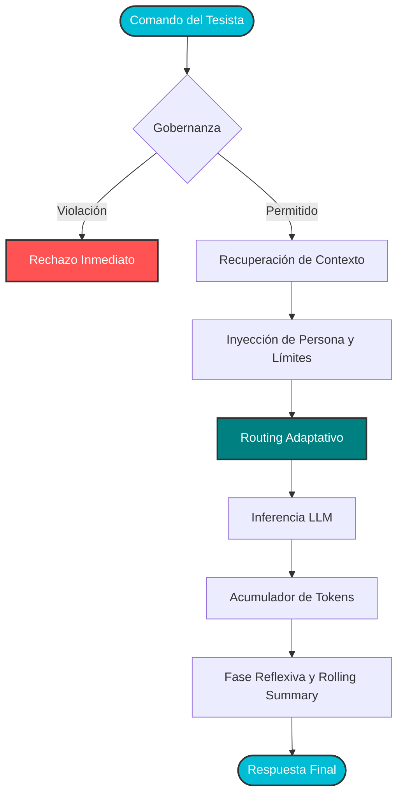
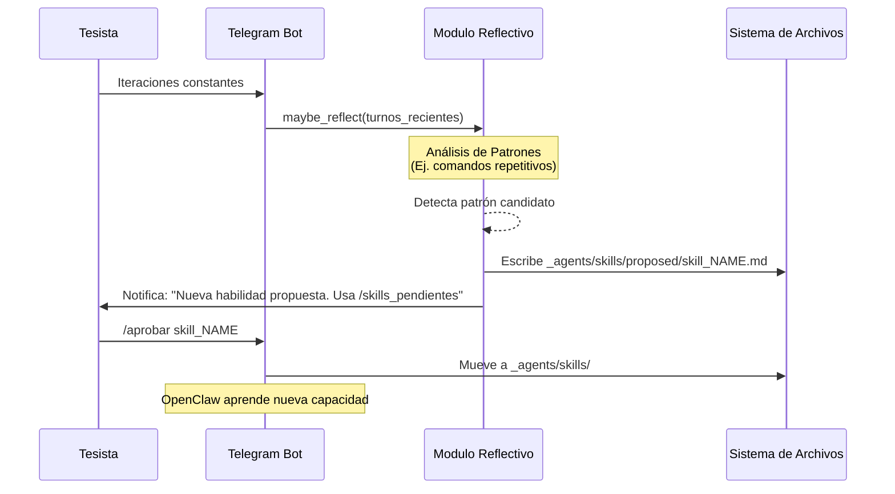

# Agente y Casos de Uso

Arquitectura teórica, routing adaptativo y fase reflexiva del agente OpenClaw.

- **Tesista:** `Erick Renato Vega Ceron`
- **Fecha:** `2026-04-29`
- **Estado:** `OK`
- **Fuentes:** `00_sistema_tesis/documentacion_sistema/casos_uso_agente.md`, `00_sistema_tesis/documentacion_sistema/guias_tareas_agente.md`
- **Aviso:** Esta wiki es un artefacto generado. Edita las fuentes canónicas y vuelve a construir.

## Navegación de esta página

- [Volver al índice](../publico/wiki/index.md).
- Página siguiente en la ruta base: [Sistema](../publico/wiki/sistema.md).
- Relacionada: [Sistema](../publico/wiki/sistema.md).
- Relacionada: [Gobernanza](../publico/wiki/gobernanza.md).
- Relacionada: [Decisiones](../publico/wiki/decisiones.md).

## Origen canónico y artefactos relacionados

### Cómo rastrear esta página hasta su origen canónico

1. Esta página derivada: [`06_dashboard/wiki/casos_uso.md`](../publico/wiki/casos_uso.md).
2. Revisa la lista de fuentes canónicas que alimentan su contenido.
3. Si necesitas la versión visual derivada, consulta el HTML hermano generado.
4. Si necesitas divulgación o evaluación externa, consulta el artefacto público sanitizado equivalente.
5. Si necesitas cambiar el contenido, edita la fuente canónica y reconstruye; no edites esta salida a mano.

### Fuentes canónicas declaradas

|Fuente canónica|Tipo|Existe|
|---|---|---|
|[`00_sistema_tesis/documentacion_sistema/casos_uso_agente.md`](https://github.com/Dtcsrni/Sistema_Operativo_Tesis_Publico/blob/main/00_sistema_tesis/documentacion_sistema/casos_uso_agente.md)|archivo|sí|
|[`00_sistema_tesis/documentacion_sistema/guias_tareas_agente.md`](https://github.com/Dtcsrni/Sistema_Operativo_Tesis_Publico/blob/main/00_sistema_tesis/documentacion_sistema/guias_tareas_agente.md)|archivo|sí|

### Artefactos derivados relacionados

- Markdown interno: [`06_dashboard/wiki/casos_uso.md`](../publico/wiki/casos_uso.md)
- HTML interno: [`06_dashboard/generado/wiki/casos_uso.html`](../publico/wiki_html/casos_uso.html)
- Markdown público sanitizado: [`06_dashboard/publico/wiki/casos_uso.md`](../publico/wiki/casos_uso.md)
- HTML público sanitizado: [`06_dashboard/publico/wiki_html/casos_uso.html`](../publico/wiki_html/casos_uso.html)

# Arquitectura y Casos de Uso del Agente OpenClaw

Este documento establece la base teórica y técnica del funcionamiento del agente soberano **OpenClaw** dentro del Sistema Operativo de Tesis. Describe cómo el agente procesa tareas, enruta la inferencia de manera adaptativa, consolida su memoria y evalúa su propia utilidad.

## 1. El Paradigma de Soberanía Híbrida

OpenClaw no es un simple envoltorio alrededor de un LLM. Es un **sistema de orquestación agéntica local** diseñado para operar con autonomía funcional, pero gobernanza estricta. Su rol principal es reducir la fricción en la ejecución de la tesis sin violar la trazabilidad inmutable del Ledger.

El sistema se fundamenta en tres pilares arquitectónicos:
- **Routing Adaptativo:** Decisión en tiempo real del motor de inferencia (CPU, GPU o Edge NPU) según la carga cognitiva requerida.
- **Ventana de Contexto Persistente (Rolling Summary):** Mantenimiento de memoria a largo plazo bajo un presupuesto de tokens finito.
- **Fase Reflexiva:** Capacidad de analizar patrones de interacción y proponer nuevas habilidades (*Skills*) codificadas.

---

## 2. Flujo de Vida de una Tarea

Cuando el tesista emite un comando estructurado (ej. `/investiga` o `/chat`), OpenClaw inicia un pipeline riguroso de validación, enrutamiento, síntesis y registro.



### Explicación del Pipeline
1. **Gobernanza Inmediata:** Antes de cualquier inferencia, el sistema verifica si la solicitud compromete archivos protegidos sin autorización.
2. **Contexto y Persona:** Se ensambla el *system prompt* usando formato ChatML (optimizado para Hermes 3 y Qwen 2.5), inyectando el estado actual de la tesis y las reglas operativas.
3. **Presupuesto de Tokens:** La inferencia es observada por un monitor de tokens que debita el uso del presupuesto diario del nodo.

---

## 3. Arquitectura de Routing Adaptativo (Edge vs. PC)

Uno de los aportes tecnológicos del sistema es la capacidad de decidir dinámicamente qué hardware ejecutará el modelo fundacional, balanceando latencia, consumo energético y calidad de síntesis.

```mermaid
graph LR
    subgraph Orquestador Local
        R[Router Adaptativo]
        idx[(index.json)]
    end

    subgraph PC Control (CUDA)
        H8B[Hermes 3: 8B]
        Q4B_PC[Qwen 2.5: 4B]
    end

    subgraph Nodo Edge IoT (NPU)
        Q3B[Qwen 2.5: 3B RKLLM]
    end

    R -. Lee Benchmark .-> idx
    R -- Tarea Compleja / Síntesis --> H8B
    R -- Tarea Simple / Alta Velocidad --> Q4B_PC
    R -- Operación Desconectada / IoT --> Q3B

    classDef tech fill:#f9f9f9,stroke:#666,stroke-width:1px;
    class H8B,Q4B_PC,Q3B tech;
```

### Criterios de Enrutamiento
- **Hermes 3 (8B):** Se selecciona si el archivo de benchmark (`index.json`) determina que el modelo supera los **25 Tokens Por Segundo (TPS)**. Al ser un modelo más grande, garantiza mayor calidad en síntesis académica, revisión de literatura y análisis complejo, siempre que la GPU local (RTX) soporte la carga eficientemente.
- **Qwen 2.5 (3B/4B):** Actúan como baselines ultrarrápidos (hasta 85 TPS). Se priorizan para tareas mecánicas, consultas rápidas de estado, o cuando se opera desde el nodo Edge (Orange Pi 5 Plus usando inferencia nativa NPU).

---

## 4. La Fase Reflexiva y Generación de Skills

Para evitar el estancamiento evolutivo, OpenClaw implementa una **fase reflexiva no bloqueante** al final de los ciclos de interacción.



Esta mecánica asegura que el agente desarrolle herramientas específicas (como monitores hardware o parsers de datos) de forma orgánica según las necesidades reales del investigador, pero exigiendo siempre un `[VAL-STEP]` explícito del tesista para activar la nueva habilidad.

---
# Guías de Tareas con el Agente OpenClaw

Esta sección proporciona tutoriales prácticos y guías de tareas para maximizar el uso del agente soberano en el flujo de investigación de la tesis.

## 1. Investigación y Síntesis Académica (`/investiga`)

El comando `/investiga` está diseñado para realizar búsquedas profundas y síntesis académicas utilizando el modelo más capaz (actualmente **Hermes 3: 8B** en el PC).

### Escenario: Revisión de Literatura
1. **Prompt:** `/investiga "Estado del arte sobre sistemas operativos embebidos para IoT con enfoque en resiliencia 2023-2026"`
2. **Lo que hace OpenClaw:**
   - Realiza búsquedas web multi-fuente.
   - Filtra por relevancia académica.
   - Genera un reporte estructurado con citas y referencias.
   - Inyecta la trazabilidad en el ledger (`[VAL-STEP]`).

### Buenas Prácticas
- Usa comillas para términos específicos.
- Especifica el rango de años para forzar actualidad.
- Solicita formatos específicos (ej. "Resume en una tabla comparativa").

---

## 2. Depuración de Datos IoT y Sensores (`/debug`)

Cuando el nodo Edge detecta anomalías en los sensores (intermitencia), OpenClaw puede ayudar a diagnosticar la causa raíz.

### Escenario: Fallo de Conectividad en Pachuca
1. **Prompt:** `/chat "Analiza los últimos logs de conectividad del nodo B1 y busca patrones de caída de energía"`
2. **Lo que hace OpenClaw:**
   - Recupera logs de `00_sistema_tesis/bitacora/`.
   - Cruza datos con la taxonomía de intermitencia urbana.
   - Sugiere si el fallo es por red o por suministro eléctrico local.

---

## 3. Gobernanza y Gestión de Decisiones (`/decision`)

OpenClaw asiste en la creación de registros formales que cumplen con los guardrails del sistema.

### Escenario: Cambio de Política de Inferencia
1. **Flujo de Trabajo:**
   - Discute la idea con el agente en `/chat`.
   - Solicita: `"Genera un borrador de DEC-XXXX siguiendo la política de soberanía para cambiar el modelo base a Qwen 2.5"`.
   - El agente genera el Markdown con los bloques de auditoría obligatorios (`[LID]`, `[GOV]`, `[AUD]`).
2. **Validación:**
   - Revisa el archivo generado.
   - Firma digitalmente (Step ID).

---

## 4. Automatización de Backups y Salud del Sistema

Uso de herramientas CLI integradas para mantener la integridad de la tesis.

### Comandos Rápidos vía Bot
- `/status`: Reporte rápido de salud (Storage, VRAM, Token Budget).
- `/backup`: Inicia el pipeline de respaldo encriptado.
- `/audit`: Ejecuta `build_all.py` y reporta fallos de trazabilidad.

---

## Cuadro Maestro de Capacidades

| Categoría | Comando | Modelo Recomendado | Nivel de Autonomía |
|-----------|---------|-------------------|--------------------|
| **Investigación** | `/investiga` | Hermes 3 (8B) | Supervisada |
| **Consultas** | `/chat` | Qwen 2.5 (3B/4B) | Alta |
| **Codificación** | `/chat` | Qwen 2.5-Coder | Media |
| **Diagnóstico** | `/status` | N/A (Scripts) | Total |

> [!IMPORTANT]
> Recuerda que toda acción significativa debe quedar reflejada en el Ledger. La IA propone, pero el Tesista Soberano certifica.

_Última actualización: `2026-04-29`._
