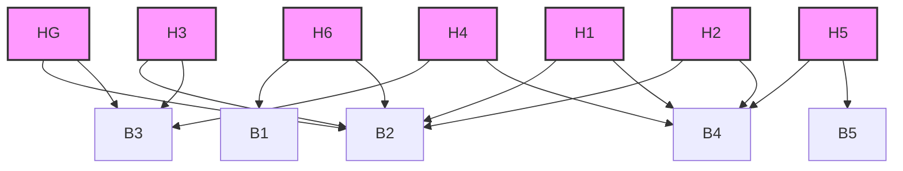

# Hipótesis

Hipótesis activas, criterios de soporte, evidencia y relación con bloques.

- **Tesista:** `Erick Renato Vega Ceron`
- **Fecha:** `2026-03-26 23:23:32`
- **Estado:** `OK`
- **Fuentes:** `00_sistema_tesis/config/hipotesis.yaml`, `00_sistema_tesis/config/bloques.yaml`
- **Aviso:** Esta wiki es un artefacto generado. Edita las fuentes canónicas y vuelve a construir.

## Mapa de Hipótesis

## Hipótesis activas

|ID|Nombre|Prioridad|Estado|Bloques|Criterio de soporte|
|---|---|---|---|---|---|
|HG|Superioridad integrada de arquitectura resiliente|critica|activa|B2, B3, B4, B5, B6, B7|Se considera soportada si la arquitectura propuesta supera consistentemente a la línea base en continuidad útil y control bajo escenarios intermitentes definidos, sin costos operativos desproporcionados.|
|H1|Buffer adaptativo reduce pérdida útil|alta|activa|B2, B4, B5, B6|Soportada si mejora la entrega útil y mantiene la edad de información dentro de umbrales definidos para variables críticas.|
|H2|Topología híbrida mejora resiliencia|alta|activa|B2, B4, B5, B6, B7|Soportada si la topología híbrida conserva más funciones esenciales y recupera antes que la línea base centralizada.|
|H3|Priorización contextual protege variables críticas|critica|activa|B2, B3, B4, B5, B6|Soportada si reduce latencia y pérdida de variables críticas bajo carga/intermitencia con impacto aceptable en tráfico secundario.|
|H4|Control degradable mantiene estabilidad útil|alta|activa|B3, B4, B5, B6, B7|Soportada si el modo degradado mantiene variables dentro de una banda operativa segura más tiempo que la línea base.|
|H5|Transferencia simulación a experimento es consistente|alta|activa|B4, B5, B6, B7|Soportada si las tendencias principales se conservan y la desviación entre simulación y experimento permanece dentro del margen acordado.|
|H6|Perfil urbano de Pachuca aporta valor de diseño|media|activa|B1, B2, B4, B6, B7|Soportada si el contexto local modifica de manera explícita y trazable parámetros, escenarios o decisiones respecto de una formulación genérica.|

