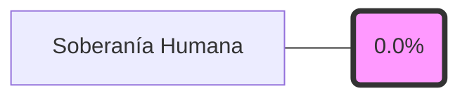

# Wiki verificable del sistema operativo de tesis

Definir la wiki derivada, verificable y reconstruible del sistema operativo de tesis a partir de fuentes canónicas.

- **Tesista:** `Erick Renato Vega Ceron`
- **Fecha:** `2026-03-26 23:11:14`
- **Estado:** `OK`
- **Fuentes:** `README_INICIO.md`, `00_sistema_tesis/manual_operacion_humana.md`, `00_sistema_tesis/config/sistema_tesis.yaml`, `00_sistema_tesis/config/hipotesis.yaml`, `00_sistema_tesis/config/bloques.yaml`, `00_sistema_tesis/config/dashboard.yaml`, `00_sistema_tesis/config/ia_gobernanza.yaml`, `00_sistema_tesis/config/publicacion.yaml`, `01_planeacion/backlog.csv`, `01_planeacion/riesgos.csv`, `01_planeacion/roadmap.csv`, `01_planeacion/entregables.csv`, `00_sistema_tesis/decisiones`, `00_sistema_tesis/bitacora`, `00_sistema_tesis/reportes_semanales`, `02_experimentos`, `04_implementacion`, `05_tesis`
- **Aviso:** Esta wiki es un artefacto generado. Edita las fuentes canónicas y vuelve a construir.

## Estado de verificación

- Fecha de generación: `2026-03-26 23:11:14`
- Estado de verificación: `ok`
- Fuentes canónicas: `README_INICIO.md`, `00_sistema_tesis/manual_operacion_humana.md`, `00_sistema_tesis/config/sistema_tesis.yaml`, `00_sistema_tesis/config/hipotesis.yaml`, `00_sistema_tesis/config/bloques.yaml`, `00_sistema_tesis/config/dashboard.yaml`, `00_sistema_tesis/config/ia_gobernanza.yaml`, `00_sistema_tesis/config/publicacion.yaml`, `01_planeacion/backlog.csv`, `01_planeacion/riesgos.csv`, `01_planeacion/roadmap.csv`, `01_planeacion/entregables.csv`, `00_sistema_tesis/decisiones`, `00_sistema_tesis/bitacora`, `00_sistema_tesis/reportes_semanales`, `02_experimentos`, `04_implementacion`, `05_tesis`

## Métrica de Soberanía Humana

Actualmente, el **0.0%** de los artefactos nucleares de esta tesis han sido verificados y firmados por el tesista humano.

## Índice

- [Sistema](sistema.md)
- [Gobernanza](gobernanza.md)
- [Hipótesis](hipotesis.md)
- [Bloques](bloques.md)
- [Planeación](planeacion.md)
- [Decisiones](decisiones.md)
- [Bitácora](bitacora.md)
- [Experimentos](experimentos.md)
- [Implementación](implementacion.md)
- [Tesis](tesis.md)

## Operación humana y frontera público/privado

- La superficie **privada** gobierna canon, backlog, decisiones, bitácora y auditoría completa.
- La superficie **pública** es un bundle sanitizado, derivado y reproducible para divulgación y evaluación externa.
- La **IA es opcional**: el sistema debe poder retomarse, auditarse y publicarse siguiendo rutas humanas explícitas.

## Qué revisar siempre

- `00_sistema_tesis/manual_operacion_humana.md`
- `00_sistema_tesis/config/sistema_tesis.yaml`
- `01_planeacion/backlog.csv`
- `01_planeacion/riesgos.csv`
- `00_sistema_tesis/bitacora/matriz_trazabilidad.md`
- `06_dashboard/wiki/index.md`
- `06_dashboard/generado/index.html`
- `06_dashboard/publico/index.md`

## Criterios de verificabilidad

- Toda página debe declarar sus fuentes canónicas.
- Toda página debe exponer fecha de generación y estado de verificación.
- La wiki debe reflejar directorios vacíos como cobertura pendiente, sin inventar contenido.
- Toda salida debe poder regenerarse de forma determinista desde scripts versionados.

