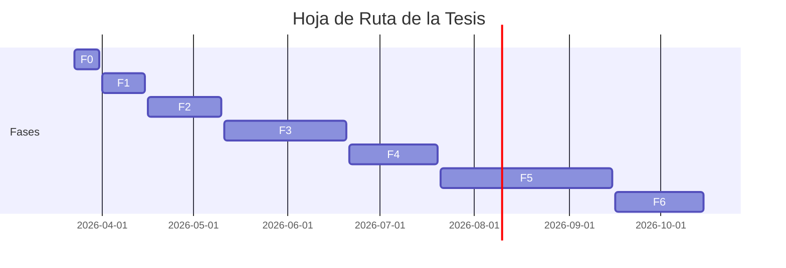

# Planeación

Backlog, riesgos, roadmap y entregables del sistema.

- **Tesista:** `Erick Renato Vega Ceron`
- **Fecha:** `2026-04-14`
- **Estado:** `OK`
- **Fuentes:** `01_planeacion/backlog.csv`, `01_planeacion/riesgos.csv`, `01_planeacion/roadmap.csv`, `01_planeacion/entregables.csv`
- **Aviso:** Esta wiki es un artefacto generado. Edita las fuentes canónicas y vuelve a construir.

## Navegación de esta página

- [Volver al índice](../publico/wiki/index.md).
- Página anterior en la ruta base: [Terminología](../publico/wiki/terminologia.md).
- Página siguiente en la ruta base: [Hipótesis](../publico/wiki/hipotesis.md).
- Relacionada: [Bloques](../publico/wiki/bloques.md).
- Relacionada: [Hipótesis](../publico/wiki/hipotesis.md).
- Relacionada: [Decisiones](../publico/wiki/decisiones.md).

## Origen canónico y artefactos relacionados

### Cómo rastrear esta página hasta su origen canónico

1. Esta página derivada: [`06_dashboard/wiki/planeacion.md`](../publico/wiki/planeacion.md).
2. Revisa la lista de fuentes canónicas que alimentan su contenido.
3. Si necesitas la versión visual derivada, consulta el HTML hermano generado.
4. Si necesitas divulgación o evaluación externa, consulta el artefacto público sanitizado equivalente.
5. Si necesitas cambiar el contenido, edita la fuente canónica y reconstruye; no edites esta salida a mano.

### Fuentes canónicas declaradas

|Fuente canónica|Tipo|Existe|
|---|---|---|
|[`01_planeacion/backlog.csv`](https://github.com/Dtcsrni/Sistema_Operativo_Tesis_Publico/blob/main/01_planeacion/backlog.csv)|archivo|sí|
|[`01_planeacion/riesgos.csv`](https://github.com/Dtcsrni/Sistema_Operativo_Tesis_Publico/blob/main/01_planeacion/riesgos.csv)|archivo|sí|
|[`01_planeacion/roadmap.csv`](https://github.com/Dtcsrni/Sistema_Operativo_Tesis_Publico/blob/main/01_planeacion/roadmap.csv)|archivo|sí|
|[`01_planeacion/entregables.csv`](https://github.com/Dtcsrni/Sistema_Operativo_Tesis_Publico/blob/main/01_planeacion/entregables.csv)|archivo|sí|

### Artefactos derivados relacionados

- Markdown interno: [`06_dashboard/wiki/planeacion.md`](../publico/wiki/planeacion.md)
- HTML interno: [`06_dashboard/generado/wiki/planeacion.html`](../publico/wiki_html/planeacion.html)
- Markdown público sanitizado: [`06_dashboard/publico/wiki/planeacion.md`](../publico/wiki/planeacion.md)
- HTML público sanitizado: [`06_dashboard/publico/wiki_html/planeacion.html`](../publico/wiki_html/planeacion.html)

## Qué resuelve este subsistema

- Traduce la estrategia de tesis en trabajo secuenciado, riesgos visibles y entregables verificables.
- Permite entender qué sigue, qué amenaza el avance y qué artefacto representa cada salida mayor.
- Hace explícita la diferencia entre estructura de bloques y ejecución operativa concreta.

## Lectura rápida

- Tareas pendientes o en progreso: `20`
- Riesgos abiertos: `8`
- Entregables definidos: `15`

## Convenciones de planeación

- `B{n}`: bloque macro del sistema o de la tesis.
- `T-{nnn}`: tarea concreta del backlog.
- `R-{nnn}`: riesgo registrado.
- `ENT-{nnn}`: entregable mayor.
- `F{n}`: fase del roadmap.
- El detalle normativo completo se resume en la página de terminología y en `backlog_guia.md`.

## Visualización del Cronograma

## Backlog prioritario

|Task|Bloque|Tarea|Prioridad|Estado|Fecha objetivo|
|---|---|---|---|---|---|
|T-001|B0|Cerrar estructura canónica inicial del sistema operativo|critica|hecho|2026-03-23|
|T-002|B0|Dejar README_INICIO orientado a retoma en menos de 3 minutos|alta|hecho|2026-03-23|
|T-003|B0|Implementar generador de dashboard HTML estático|critica|hecho|2026-03-23|
|T-004|B0|Implementar validaciones mínimas de consistencia entre YAML y CSV|critica|hecho|2026-03-23|
|T-005|B0|Crear plantillas operativas de decisión bitácora y resumen semanal|alta|hecho|2026-03-23|
|T-006|B0|Exportar hoja maestra consolidada desde fuentes canónicas|media|hecho|2026-03-23|
|T-007|B1|Delimitar formalmente el caso de estudio en la Zona Metropolitana de Pachuca|critica|pendiente|2026-03-30|
|T-008|B1|Definir taxonomía inicial de intermitencia urbana relevante para la tesis|alta|pendiente|2026-04-02|
|T-009|B1|Identificar variables críticas y no críticas por escenario operativo|alta|pendiente|2026-04-04|
|T-010|B2|Definir arquitectura base de comparación contra la propuesta|critica|pendiente|2026-04-05|

## Riesgos abiertos

|Risk|Riesgo|Probabilidad|Impacto|Estado|
|---|---|---|---|---|
|R-001|Deriva entre fuentes canónicas y artefactos generados|media|alto|abierto|
|R-002|Ambigüedad en la línea base de comparación|alta|alto|abierto|
|R-003|Escenarios de intermitencia poco representativos del caso de estudio|media|alto|abierto|
|R-004|Sobrecarga operativa por exceso de documentación|media|medio| plantillas cortas y un solo punto de verdad por artefacto|
|R-005|Dependencia excesiva de IA en tareas sustantivas|media|alto|abierto|
|R-006|Desalineación entre simulación y experimento|media|alto|abierto|
|R-007|Consumo ineficiente del presupuesto de uso por sobrerazonamiento o exploración redundante|media|medio|abierto|
|R-008|Exposición pública sin sanitización suficiente|media|alto|abierto|
|R-009|Complejidad documental por duplicación entre capa humana y automatización|media|medio|abierto|

## Entregables

|ID|Nombre|Estado|Artefacto canónico|
|---|---|---|---|
|ENT-001|Base operativa del sistema de tesis|listo|README_INICIO.md|
|ENT-002|Automatización base y dashboard|listo|06_dashboard/generado/index.html|
|ENT-003|Definición del caso de estudio y supuestos de intermitencia|pendiente|00_sistema_tesis/decisiones|
|ENT-004|Arquitectura propuesta y línea base|pendiente|00_sistema_tesis/config/hipotesis.yaml|
|ENT-005|Cuadro maestro de métricas y escenarios|pendiente|02_experimentos/simulacion|
|ENT-006|Paquete de simulación reproducible|pendiente|02_experimentos/simulacion|
|ENT-007|Prototipo instrumentado|pendiente|04_implementacion|
|ENT-008|Evidencia experimental trazable|pendiente|02_experimentos/validacion_experimental|
|ENT-009|Análisis integrado y discusión|pendiente|05_tesis/capitulos|
|ENT-010|Manuscrito base de tesis|pendiente|05_tesis|
|ENT-011|Paquete sanitizado reproducible|pendiente|06_dashboard/generado|
|ENT-012|Cierre y defensa|pendiente|05_tesis|
|ENT-013|Infraestructura edge_iot aislada y validada en Orange Pi|pendiente|04_implementacion/edge_iot|
|ENT-014|Arquitectura formal del sistema operativo de tesis|listo|docs/02_arquitectura/arquitectura-general.md|
|ENT-015|Conformidad y eficiencia operativa del sistema de tesis|pendiente|tests/integration/test_repo_layout.sh|

_Última actualización: `2026-04-13`._
