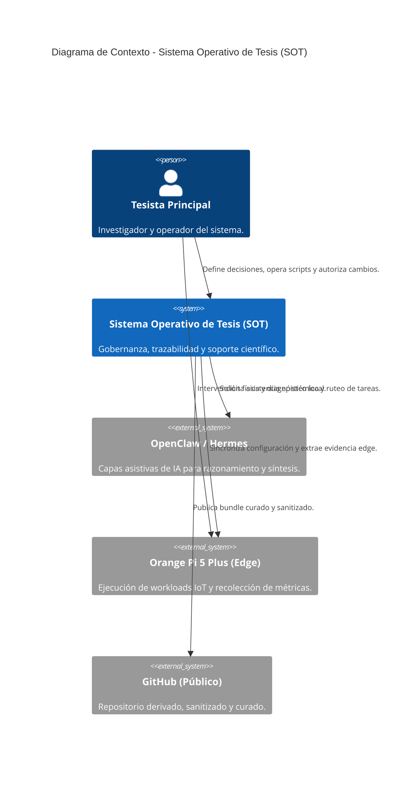
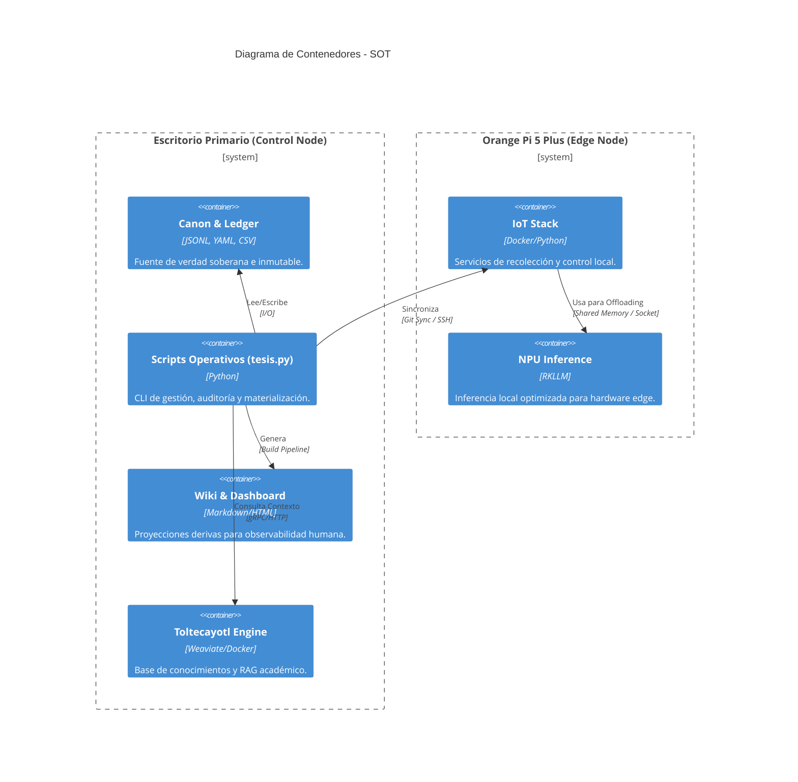
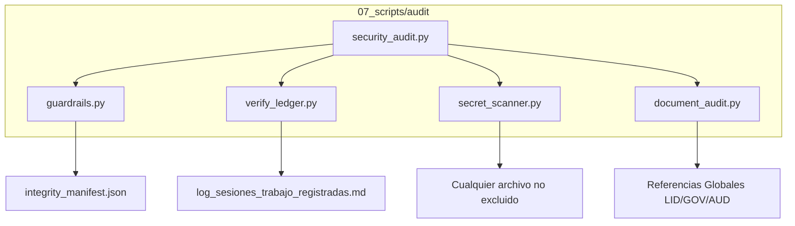

# Diagramas de Arquitectura (Modelo C4)

Este documento utiliza el estándar C4 para visualizar la arquitectura del Sistema Operativo de Tesis en diferentes niveles de abstracción.

## 1. Nivel 1: Contexto del Sistema
El diagrama de contexto muestra cómo el Sistema Operativo de Tesis interactúa con los actores humanos y otros sistemas externos.

## 2. Nivel 2: Contenedores
El diagrama de contenedores detalla los componentes lógicos internos del SOT y cómo se distribuyen entre el Escritorio y el nodo Edge.

## 3. Nivel 3: Componentes (Scripts de Auditoría)
Muestra la interacción interna de la capa de auditoría y guardrails.

_Última actualización: `2026-05-15`._
